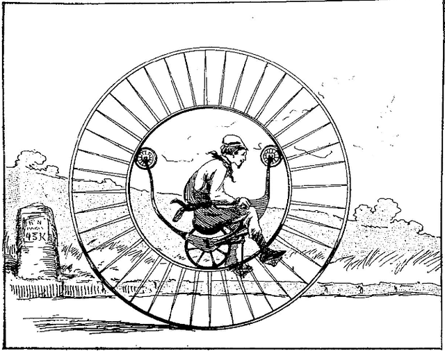

# Chapter Title
Your name

## Exercise 1

### a)

You can write text wherever you want, just by writing text. For code, you can write chunks with three backticks as follows. Adding `js` after the backticks highlights the syntax as JavaScript.
```js
// example WebPPL code
var exampleFn = function() {
    return flip ? "h" : "t"
}

viz(Infer(exampleFn))
```

### b)

You can also write math in LaTeX. Use single dollar signs for inline math ($x^2 = \sqrt{y_0}$) and double dollar signs for block math. For example

$$
p(B|A) = \frac{p(A|B)p(A)}{p(B)}
$$

## Exercise 2

### c)

You can include images in your report with !\[\]\(path/to/image\). For example:

{width=200px}

That should be all you need to do your ProbMods homework. Good luck!


